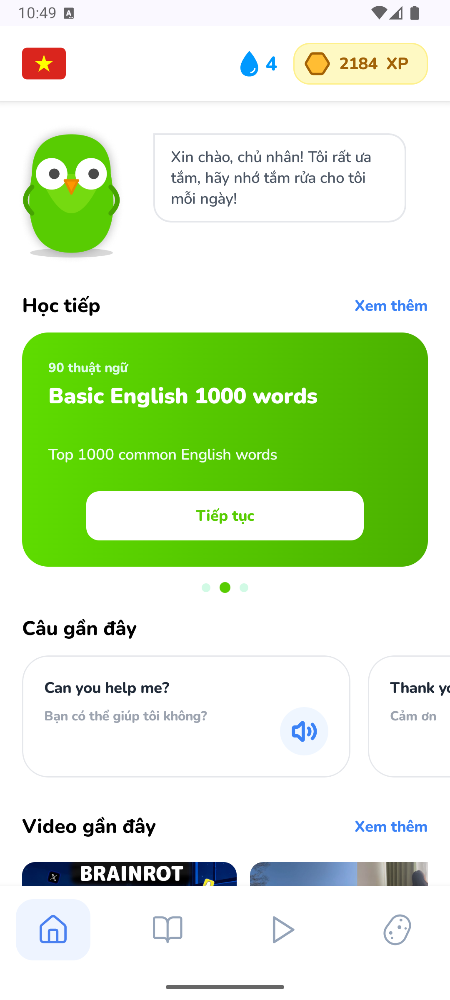
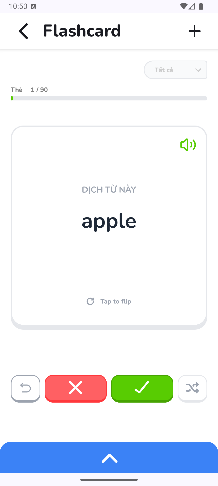
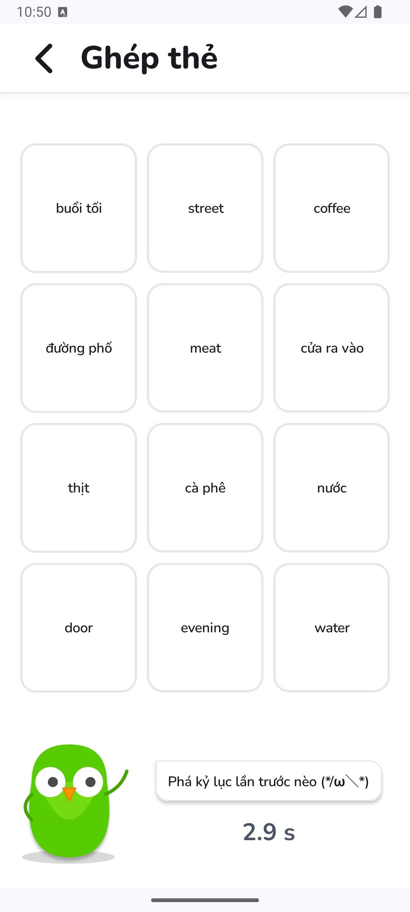
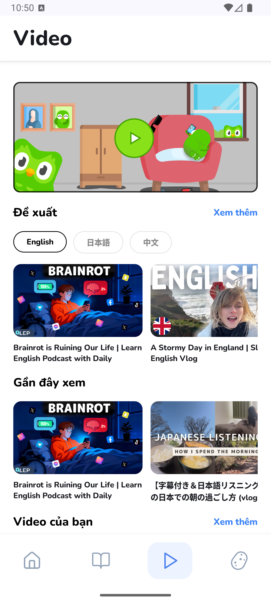
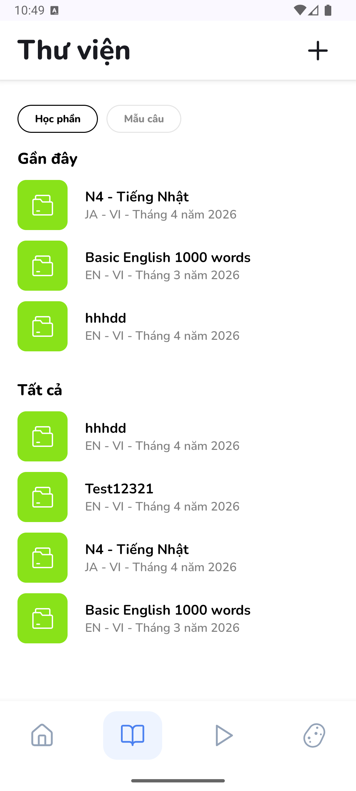
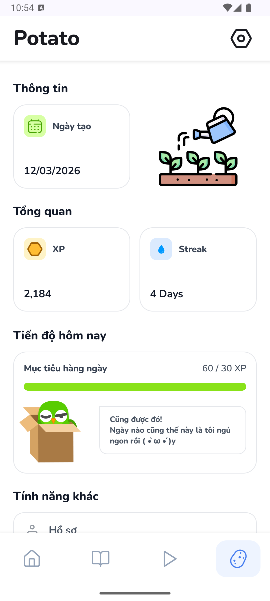
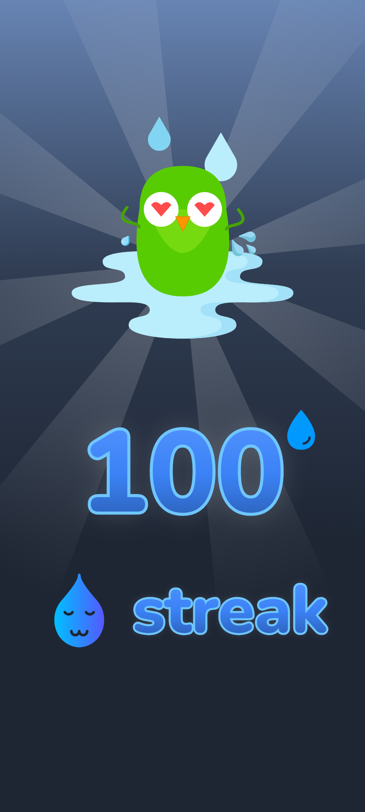
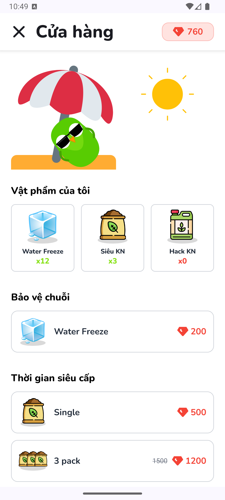
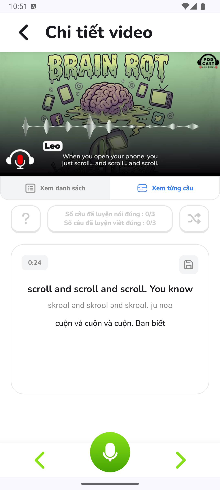
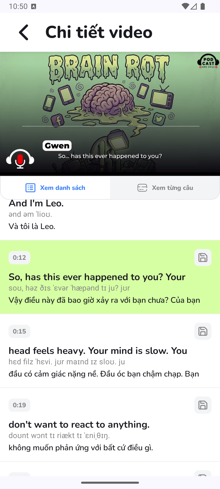

<h3 align="center">Master language learning through <i>interactive games, video content, and smart gamification</i>.</h3>

<p align="center"></p>
<h2 align="center"><b>Potago</b></h2>
<h4 align="center">Interactive Language Learning Platform for Android</h4>

<p align="center">
<a href="https://github.com/duanhap/PotagoApp/releases" alt="GitHub Releases"></a>
<a href="https://www.gnu.org/licenses/gpl-3.0" alt="License: GPLv3"></a>
<a href="https://github.com/duanhap/PotagoApp/actions" alt="Build Status"></a>
<a href="#" alt="Android Min SDK"></a>
</p>

<p align="center">
<a href="#screenshots">Screenshots</a> &bull; <a href="#features">Features</a> &bull; <a href="#description">Description</a> &bull; <a href="#installation-and-updates">Installation</a> &bull; <a href="#usage">Usage</a> &bull; <a href="#contribution">Contribution</a> &bull; <a href="#license">License</a>
</p>

<p align="center">
<b>Read this document in other languages:</b>
<a href="README.md">English</a> &bull; <a href="docs/README.ja.md">日本語</a> &bull; <a href="docs/README.vi.md">Tiếng Việt</a>
</p>

<hr>

## Screenshots

[](assets/screenshots/home_screen.png)
[](assets/screenshots/flashcard_screen.png)
[](assets/screenshots/match_game_screen.png)
[](assets/screenshots/video_screen.png)
[](assets/screenshots/library_screen.png)
[](assets/screenshots/profile_screen.png)

[](assets/screenshots/streak_screen.png)
[](assets/screenshots/shop_screen.png)
[](assets/screenshots/speaking_screen.png)
[](assets/screenshots/video_player_screen.png)

## Description

**Potago** is a modern, gamified language learning platform that transforms the way you learn new languages. Combining interactive flashcards, timed matching games, video content, and a rich achievement system, Potago makes language learning engaging, fun, and effective.

Built with modern Android technologies (Kotlin, Jetpack Compose, Material 3), Potago delivers a smooth, beautiful user experience across all Android devices. Whether you're a beginner exploring new vocabulary or an advanced learner perfecting your skills, Potago adapts to your learning pace and keeps you motivated through its intelligent gamification system.

### Target Users
- Language learners of all proficiency levels
- Students studying vocabulary and grammar
- Educators seeking interactive learning tools
- Anyone passionate about language acquisition

## Features

### Core Learning Tools
* **Interactive Flashcards** - Create, organize, and master vocabulary with customizable word sets
* **Match Games** - Timed word matching challenges to test your knowledge and compete for best times
* **Writing Practice** - Practice sentence patterns and improve writing skills with real examples
* **Video Learning** - Integrated video library with YouTube content and subtitle support
* **Multi-language Support** - Learn from and to any language with flexible language pair configuration

### Gamification & Engagement
* **Experience Points System** - Earn XP for every completed learning activity
* **Daily Streaks** - Maintain consistent learning habits and protect your streaks
* **Achievement Badges** - Unlock special achievements at learning milestones
* **Leaderboard & Rankings** - Compete with other learners and track your progress
* **Virtual Rewards** - Collect diamonds and unlock premium boosts and features
* **Mascot Companion** - Meet Potago, your learning companion that grows with you

### Content Management
* **Personal Word Sets** - Build your own vocabulary collections or browse community sets
* **Video Library** - Access curated educational videos or upload your own learning resources
* **Learning History** - Track your recent activities and progress over time
* **Social Sharing** - Share word sets with friends and the community

### User Features
* **Secure Authentication** - Firebase-backed authentication for account security
* **Customizable Profile** - Upload avatars and personalize your learning space
* **Flexible Settings** - Control notifications, language preferences, and learning goals
* **Cloud Sync** - Your progress syncs across all your devices
* **In-App Shop** - Purchase helpful items like streak protections and experience boosters

## Supported Android Versions

| Version | Status |
| --- | --- |
| Android 9+ (API 28) | Fully Supported |
| Android 15 (API 35) | Target Version |

Potago requires **Android 9 or higher** and works best on **Android 11+** for full feature support.

## Installation and Updates

### 1. Download APK from GitHub Releases (Recommended)
Visit our [GitHub Releases](https://github.com/duanhap/PotagoApp/releases) page to download the latest APK directly.

```bash
# Verify the APK signature (optional but recommended)
# SHA-256: [YOUR_SHA_256_HASH]
```

### 2. Build from Source
Clone the repository and build using Android Studio or Gradle:

```bash
git clone https://github.com/duanhap/PotagoApp.git
cd PotagoApp
./gradlew assembleDebug  # Build debug APK
./gradlew assembleRelease  # Build release APK
```

The built APK will be in `app/build/outputs/apk/`.

### 3. F-Droid (Future)
We're working on F-Droid support. Check back soon!

### Installation Steps
1. Enable "Unknown Sources" in Android Settings > Security
2. Download the APK file
3. Open the APK and tap "Install"
4. Grant necessary permissions (internet, notifications, etc.)
5. Launch Potago and create your account

### Updates
Future updates will be available through the GitHub Releases page. Simply download and install the new APK to update.

> [!tip]
> To backup your progress before updating: Settings > Backup & Restore > Export Database

> [!warning]
> **THIS APP IS IN ACTIVE DEVELOPMENT.** You may encounter bugs or incomplete features. Please report issues on our [GitHub Repository](https://github.com/duanhap/PotagoApp/issues).

## Usage

### Getting Started
1. **Create an Account** - Sign up with email or existing credentials
2. **Set Your Learning Goals** - Choose your target language and learning pace
3. **Create Your First Word Set** - Add vocabulary you want to master
4. **Start Learning** - Begin with flashcards, then try match games for variety
5. **Track Progress** - Monitor your streaks, XP, and achievements

### Learning Workflow
- **Flashcard Study** - Study cards at your own pace with flip animations
- **Match Game** - Test your knowledge in timed challenges
- **Writing Practice** - Perfect your writing with structured exercises
- **Watch Videos** - Reinforce learning with curated video content

### Tips for Success
- Maintain your daily streak for consistent progress
- Mix different learning modes to avoid monotony
- Review challenging words more frequently
- Use the shop to buy streak protections as you advance
- Share sets with friends to learn together

## Tech Stack

### Languages & Frameworks
- **Kotlin 100%** - Modern, expressive language for Android development
- **Jetpack Compose** - Declarative UI toolkit for beautiful interfaces
- **Material 3** - Latest Material Design specifications
- **MVVM + Clean Architecture** - Scalable, maintainable codebase

### Key Libraries
- **Hilt** - Dependency injection framework
- **Retrofit 2.9** - REST API client
- **Room Database** - Local persistence (via SQLite)
- **Firebase 33.7** - Authentication and cloud services
- **Coil 2.6** - Image loading and caching
- **Media3/ExoPlayer 1.3** - Video playback engine
- **DataStore** - Modern key-value storage
- **Ktor Client 3.1** - HTTP client alternative

### Build Tools
- **Gradle 8.7** with KSP for faster code generation
- **Java 17** compilation target
- **API 28 minimum / API 35 target**

## Privacy

Potago respects your privacy. Here's what you should know:

**Data Collection**
- User account data (email, profile info) for authentication
- Learning progress and statistics to provide personalized recommendations
- Crash reports to improve app stability (optional)

**Data NOT Collected**
- Personal browsing history outside of Potago
- Device identifiers or advertising data
- Location data or camera access
- Contact list or personal files

**Data Storage**
- Account data is encrypted and stored on our servers
- Learning progress is stored locally on your device and synced with your account
- You can export or delete your data anytime from Settings

For complete details, see our [Privacy Policy](#).

## Contribution

We welcome contributions from the community! Whether it's bug reports, feature suggestions, translations, or code, every contribution helps make Potago better.

### How to Contribute

1. **Report Bugs** - [Open an issue](https://github.com/duanhap/PotagoApp/issues) with a clear description and steps to reproduce
2. **Suggest Features** - Share your ideas on our [Discussions](https://github.com/duanhap/PotagoApp/discussions) page
3. **Submit Code** - Fork the repo, make your changes, and submit a pull request
4. **Improve Translations** - Help us reach global learners (coming soon!)

### Development Setup

```bash
# Clone the repository
git clone https://github.com/duanhap/PotagoApp.git
cd PotagoApp

# Open in Android Studio and sync Gradle
# Or build from command line:
./gradlew build

# Run tests
./gradlew test
```

### Code Guidelines
- Follow Kotlin best practices and style guides
- Write clear commit messages
- Add tests for new features
- Update documentation as needed
- Ensure your code passes linting checks

See [CONTRIBUTING.md](.github/CONTRIBUTING.md) for detailed contribution guidelines.

## Support

- **Documentation** - [Wiki](https://github.com/duanhap/PotagoApp/wiki)
- **Issue Tracker** - [GitHub Issues](https://github.com/duanhap/PotagoApp/issues)
- **Discussions** - [GitHub Discussions](https://github.com/duanhap/PotagoApp/discussions)

## License

[](https://www.gnu.org/licenses/gpl-3.0.en.html)

Potago is Free Software: You can use, study, share, and improve it at will. Specifically, you can redistribute and/or modify it under the terms of the [GNU General Public License](https://www.gnu.org/licenses/gpl.html) as published by the Free Software Foundation, either version 3 of the License, or (at your option) any later version.

```
Potago - Interactive Language Learning Platform
Copyright (C) 2024 - Potago Contributors

This program is free software: you can redistribute it and/or modify
it under the terms of the GNU General Public License as published by
the Free Software Foundation, either version 3 of the License, or
(at your option) any later version.

This program is distributed in the hope that it will be useful,
but WITHOUT ANY WARRANTY; without even the implied warranty of
MERCHANTABILITY or FITNESS FOR A PARTICULAR PURPOSE. See the
GNU General Public License for more details.
```

---

<p align="center">
  <b>Made with passion for language learners everywhere</b>
</p>